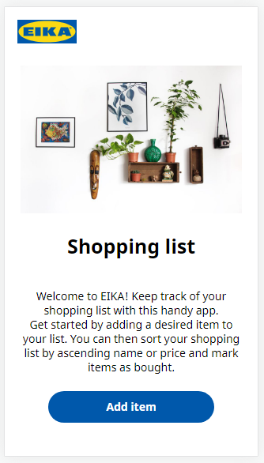
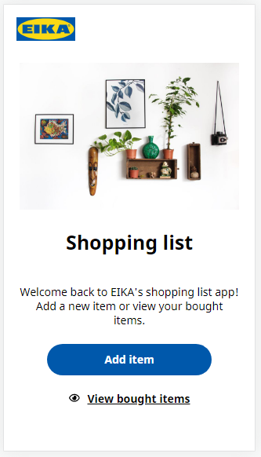
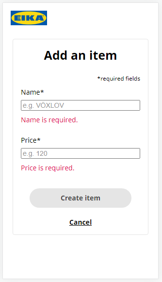
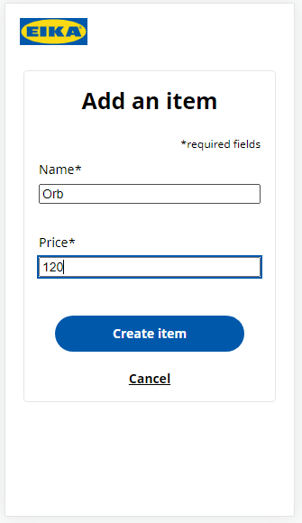
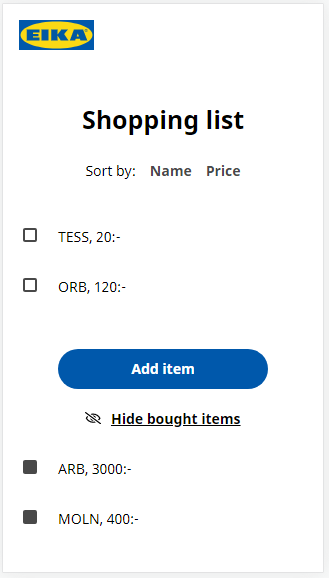
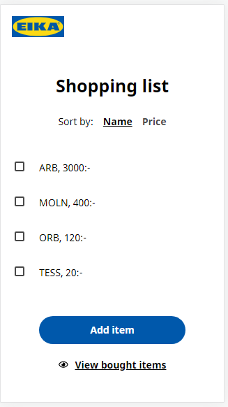
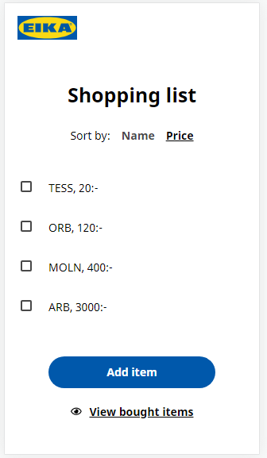

# EIKA shopping list app

## Description

A shopping list app that lets users keep track of things to buy at the EIKA store.

This project was bootstrapped with [Create React App](https://github.com/facebook/create-react-app) using the TypeScript template.

### Features

You can:

- Add a shopping item with a name and price.
- Mark a shopping item as bought.
- Toggle the display of bought shopping items.
- Close and reopen the page without losing your list.
- Sort items by name or price.

### Hosted app

The app is hosted at https://eika-shopping-list-app.web.app/

## Design prototype

[View the design at Figma.](https://www.figma.com/file/brKqUwVgro4pEbvCf7maE0/Shopping-list?node-id=0%3A1)

## Component hierarchy

[View the component hierarchy at Whimsical.](https://whimsical.com/shopping-list-KTu2Z8eFMtf9E3psbzR2Xm@2Ux7TurymMSmk6jWXHKT)

## Installation

Clone this repository: `git clone https://github.com/eeels22/eika-shopping-list.git`

To run the app in the development mode, in the project directory, run: `npm start`

Open [http://localhost:3000](http://localhost:3000) to view it in the browser.

## Build and deploy

`npm run build`

Builds the app for production to the `build` folder. It correctly bundles React in production mode and optimizes the build for the best performance. The build is minified and the filenames include the hashes.

See the React section about [deployment](https://facebook.github.io/create-react-app/docs/deployment) for more information.

## Dependencies

- "react": "^17.0.2"
- "react-dom": "^17.0.2"
- "react-scripts": "4.0.3"
- "typescript": "^4.1.2"

## Using the app

### Welcome screen

If it's your first time using the app, or if you have no items left to buy, you'll be greeting with an image and welcome paragraph.  
 

### Add a shopping item

- Click the 'Add item' button.
- Enter a valid name and price. (The 'Create item' button will remain disabled until you have entered valid inputs.)
- Click the 'Create item' button.  
   

### Mark a shopping item as bought

- Click an item to mark it as bought. This will hide it from the default view.
- Toggle between viewing and hiding the list of bought items.  
  

### Sort items

- Click on the desired sort option to sort the list by ascending name or price  
   

## Authors and acknowledgments

Coded by En-Chi Liu as part of the summer course at Novare Potential Academy.

Many thanks to Eduardo Alvarez (Tech Education Team Lead at Novare Potential) for the project brief and mentoring.

### Image credits

Welcome image by [Manja Vitolic at Unsplash](https://unsplash.com/@madhatterzone).  
Closed and open eye icons are by Font Awesome and are [licensed under the Creative Commons Attribution 4.0 International license](https://fontawesome.com/license).
